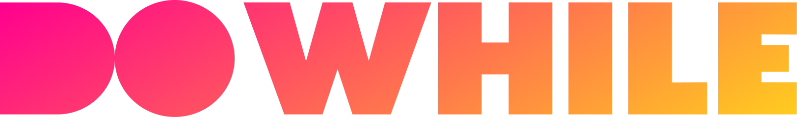

<h1 align="center">
  
</h1>

<p align="center">
  
  
  
  
  

  

  
  
  <br>
  
  
    
  
</p>

<h3 align="center">
  Index
</h3>

<p align="center">
  🔥 <a href="#%EF%B8%8F-the-project">The Project</a>&nbsp;&nbsp;&nbsp;|&nbsp;&nbsp;&nbsp;
  🤖 <a href="#-back-end">Back-End</a>&nbsp;&nbsp;&nbsp;|&nbsp;&nbsp;&nbsp;
  💻 <a href="#-front-end">Front-End</a>&nbsp;&nbsp;&nbsp;|&nbsp;&nbsp;&nbsp;
  📱 <a href="#-mobile">Mobile</a>&nbsp;&nbsp;&nbsp;|&nbsp;&nbsp;&nbsp;
  🏁 <a href="#-starting-the-project">Starting</a>
</p>

<br>

## 🚀 Next Level Week - Heat  
The Next Level Week is a project created by [RocketSeat](https://rocketseat.com.br/).

This's the 7th edition of the Next Level Week, and it's a special edition because is happening before DoWhile 2021, another Rocketseat event.

This repository contains the **Impulse** path of the NLW.

<br>

**🎓  Instructors:**<br>
* **Node.js** - [Daniele Leão](https://www.linkedin.com/in/danieleleaoevangelista/)
* **ReactJS** - [Diego Fernandes](https://www.linkedin.com/in/diego-schell-fernandes/)
* **React Native** - [Rodrigo Gonçalves](https://www.linkedin.com/in/rodrigo-goncalves-santana/)
* **Elixir** - [Rafael Camarda](https://www.linkedin.com/in/rafaelcamarda/)


**🎨  Layout made in [Figma](https://www.figma.com/) by [Tiago Luchtenberg](https://www.instagram.com/tiagoluchtenberg/)**<br>

- [X] **12/10/2020** - Accelerating your evolution (**Introduction**)
- [X] **13/10/2020** - Looking at opportunities (**Back-End**)
- [X] **14/10/2020** - The stack choice (**Front-End**)
- [X] **15/10/2020** - Up to 2 years in 2 months (**Mobile**)
- [X] **16/10/2020** - The extra mile (**Advanced Features**)

<br> 

## 🔥 The Project:

The project consists of an application for people to share their expectations for DoWhile 2021.
<br>

<div align="center">
  
  
</div>

## 🤖 Back-End
A REST API built with Node.js and TypeScript.

### 🛠 Technologies
- **[Node.js](https://nodejs.org/en/)**
- **[TypeScript](https://www.typescriptlang.org/)**
- *[Express](https://expressjs.com/pt-br/)*
- *[Prisma](https://www.prisma.io/)*

<br>

## 💻 Web
Developed with React.js and TypeScript.

### 🛠 Technologies
- **[React.js](https://reactjs.org/)**
- **[TypeScript](https://www.typescriptlang.org/)**

<br>

## 📱 Mobile
Developed with React Native, Expo, and TypeScript.

### 🛠 Technologies
- **[React Native](https://reactnative.dev/)**
- **[TypeScript](https://www.typescriptlang.org/)**
- *[Expo](https://expo.io/)*
- *[Moti](https://moti.fyi/)*

<br>

## 🏁 Starting the project:

Clone the project: `git clone https://github.com/LiajuX/NextLevelWeek-Heat`

❗ **NOTE:** If you don't have yarn installed, use npm instead.

<br>

🤖 To run the **Back-End** you shall open the terminal and run the following commands.:

````zsh
# to enter the Back-End folder
$ cd backend

# to download the dependencies
$ yarn

# to start the application on port 4000
$ yarn dev
````

<br>

💻 To run the **Web**, in another terminal tab, execute the following commands:

````zsh
# to enter the Front-End folder
$ cd web

# to download the dependencies
$ yarn

# to start the application on port 3000
$ yarn dev
````
Open `http://localhost:3000/`.

<br>

📱 To run **Mobile**, download the Expo app on your smartphone. ([Android](https://play.google.com/store/apps/details?id=host.exp.exponent&hl=pt_BR) or [iOS](https://apps.apple.com/br/app/expo-client/id982107779)).
<br>Now, on another terminal tab, run the following commands:

````zsh
# to enter the Mobile folder
$ cd mobile

# to download the dependencies
$ yarn

# to run the project
$ expo start
````
Now, you have to point your smartphone's camera to scan the QR Code displayed on the terminal or in the browser that'll open to open the application on Expo...

---

<h3 align="center" >
  Made by Júlia Brito(LiajuX)
</h3>
